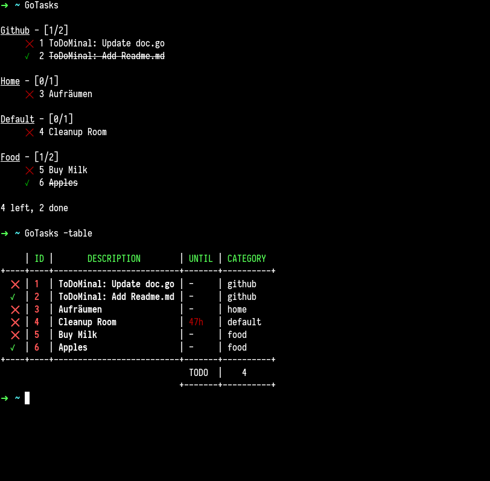

# gtask


###### Source: https://github.com/egonelbre/gophers

# Features
gtask is a terminal todo-list/task collector inspired by [taskbook](https://github.com/klaussinani/taskbook) by [klaussinani](https://github.com/klaussinani)

* Add a new task
* Mark multiple tasks as done & delete them
* Save all issues from github which have been assigned to you as tasks
* And More to come



# Installation
Run in your terminal
```bash
go get github.com/Zarathustra2/gtask
```
Now we can install it by running:

```bash
go install go/src/github.com/Zarathustra2/gtask
```

Make sure $GOPATH/bin has been exported so you can run the commands from everywhere in your
terminal.

# Usage

* Create a new task

```
gtask -i "Clean my Room" -cname "home"
```
Tasks where the category gets not specified are by default assigned to the "default" category

* Create new Task which is due in 2 days and 4 hours
```bash
gtask -i "Transfer Money to University" -d 2 -h 4
```

* Delete tasks specified by ids
```bash
gtask -ids 1,2,3,4 -del
```

* Mark tasks specified by ids as done
```bash
gtask -ids 1,2,3,4 -done
```

* Delete done tasks
```bash
gtask -delDone
```

* Show Tasks
```bash
gtask
```

* Show Tasks in a table
```bash
gtask -table
```

* Add a gittoken for downloading issues assigned to you
```bash
gtask -gittoken Some40CharsLongToken
```

* Download all issues assigned to you as a task
```bash
gtask -gitissues
```


# License

MIT
